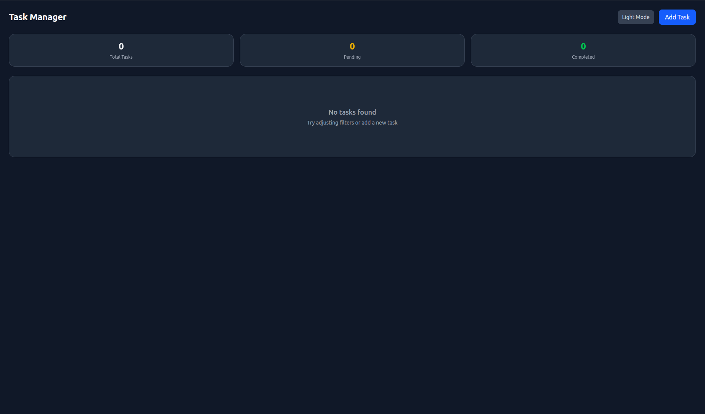
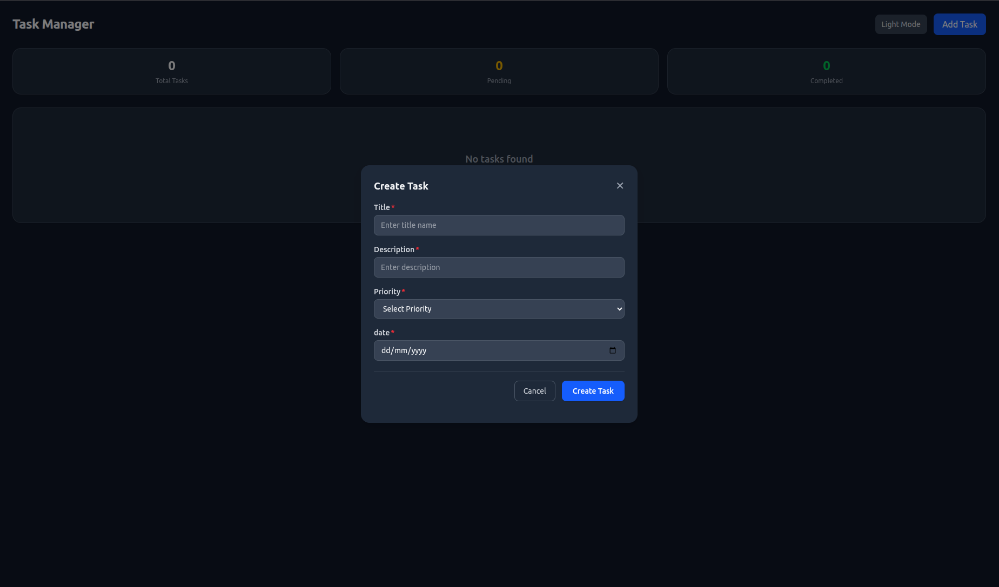
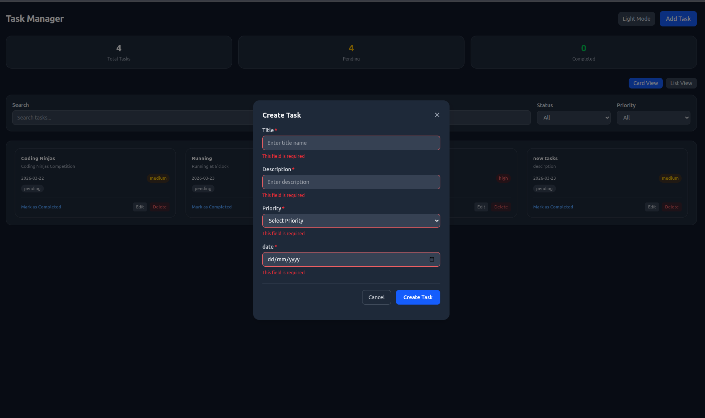
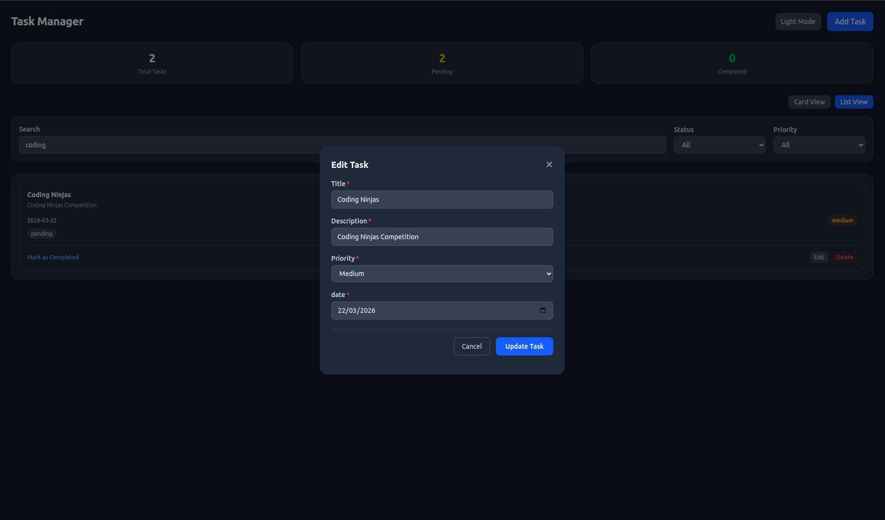
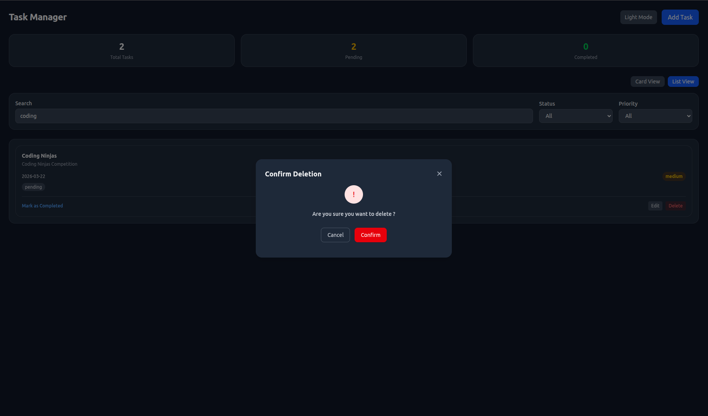
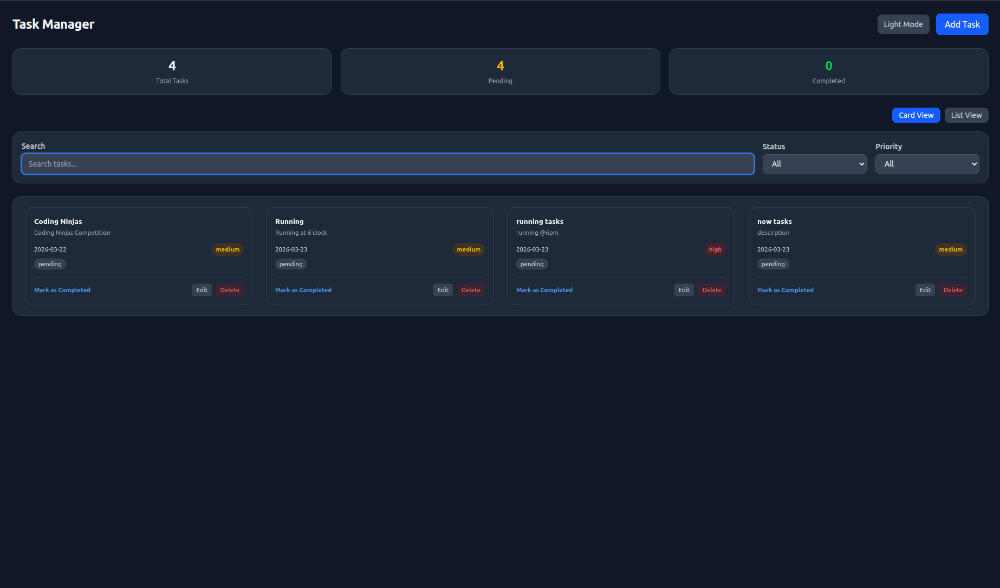
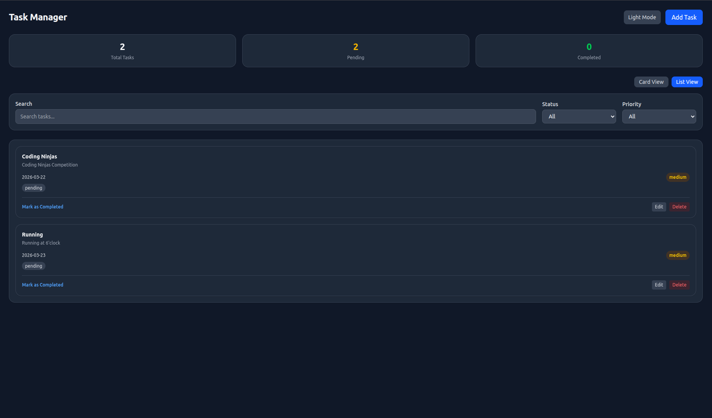
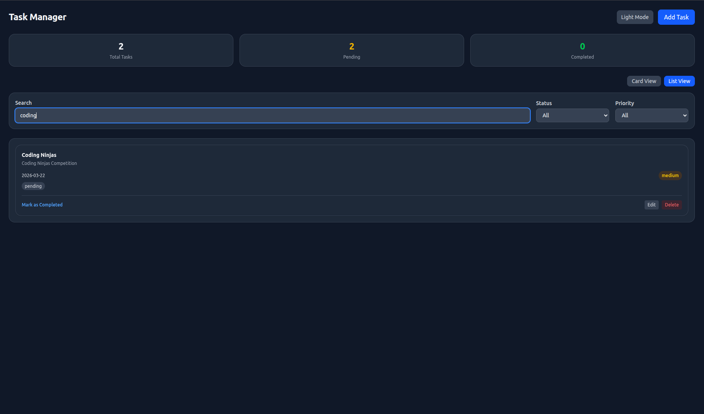
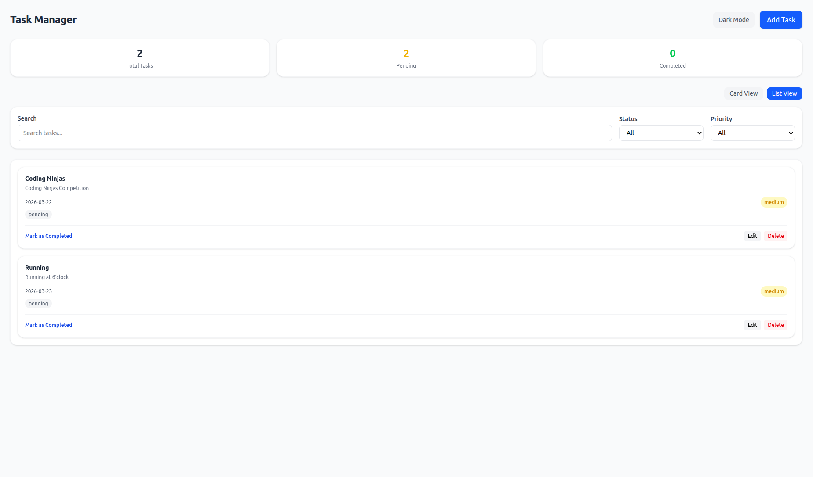

# Task Management Application

A modern, responsive, and feature-rich **Task Management Application** built using **React** and **Tailwind CSS**.  

This app demonstrates real-world frontend engineering concepts like **storage management, filtering, UI/UX design, dark mode, and scalable architecture**.


## 📸 Screenshots


### 🏠 Initial Dashboard

<p align="center">
  
</p>

### ➕ Create Task

<p align="center">
  
</p>


### ⚠️ Form Validation

<p align="center">
  
</p>


### ✏️ Edit Task

<p align="center">
  
</p>


### 🗑️ Delete Confirmation

<p align="center">
  
</p>

---

### 🗂️ Grid (Card) View

<p align="center">
  
</p>


### 📋 List View

<p align="center">
  
</p>


### 🔍 Search Functionality

<p align="center">
  
</p>


### ☀️ Light Mode

<p align="center">
  
</p>


## 🚀 Live Features

- ✅ Create, Edit, Delete Tasks  
- 📊 Task Dashboard (Total / Pending / Completed)  
- 🔍 Real-time Search  
- 🎯 Filter by Status & Priority  
- 🌓 Dark Mode / Light Mode (persisted via localStorage)  
- 🗂️ Card View & List View toggle  
- ⚠️ Form validation with error states  
- 🧠 Clean and scalable component structure
- ♿ Accessibility ( WCAG Standards )
  

## Tech Stack

**Client Side** 
- ⚛️ React (Hooks + Functional Components)
- 🎨 Tailwind CSS
- 💾 LocalStorage (for persistence)
- ⚡ Vite


## ♿ Accessibility (a11y)

This project includes accessibility enhancements to ensure a better experience for all users, including those using assistive technologies.


### ✅ Implemented Features

#### 🔘 Accessible Theme Toggle
- Uses `aria-pressed` to indicate toggle state  
- Dynamic `aria-label` ("Toggle dark mode" / "Toggle light mode")  
- Screen reader support using `sr-only`  


#### 🎯 Keyboard Accessibility
- All interactive elements are keyboard navigable  
- Visible focus states using Tailwind (`focus:ring`)  
- Logical tab order maintained  


#### 🧠 Semantic HTML
- Proper use of `<button>`, `<form>`, `<label>`  
- Avoided non-semantic clickable elements like `<div>`  


#### 🔊 Screen Reader Support
- Hidden descriptive text using `sr-only`  
- Clear, action-based labels for better usability  


#### ⚠️ Form Accessibility
- Required fields clearly indicated  
- Inline error messages for validation  
- Prevents invalid form submission  


#### 🪟 Accessible Modal (Focus Trap)

- Focus is trapped within the modal when open  
- Prevents users from tabbing outside the modal  
- Focus returns to the trigger element on close  
- Supports keyboard navigation (Tab / Shift + Tab)  
- Escape key closes the modal  


## 🚀 Live Demo

🔗 https://task-app-dev.netlify.app


## Run Locally

Clone the project

```bash
  git clone git@github.com:chethan-kumar-FSE/task-management.git
```

Go to the project directory

```bash
  cd task-management
```

Install dependencies

```bash
  npm install
```

Start the server

```bash
  npm run dev
```
